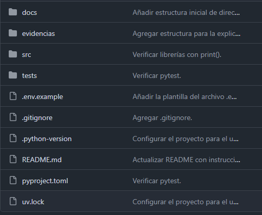
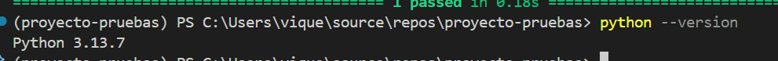
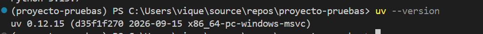
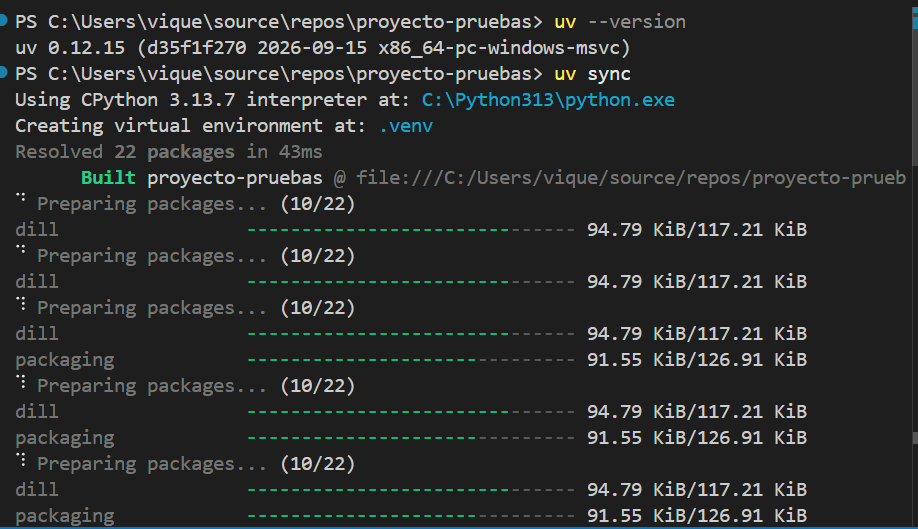
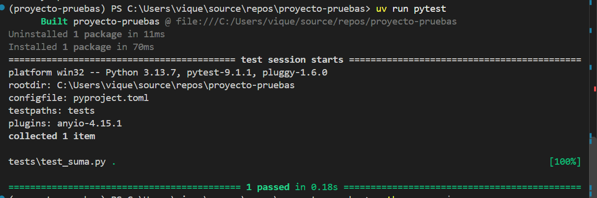
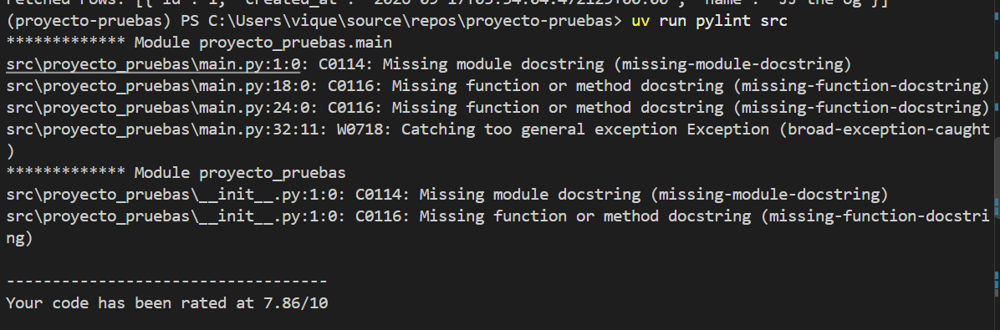
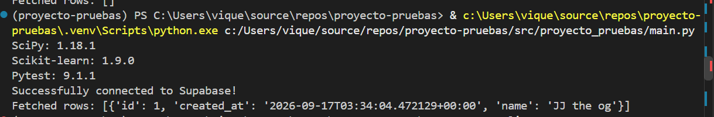

<!-- Portada -->
<div align="center">

# Universidad de Costa Rica

<br>
<br>

### Pruebas de software

<br>
<br>
<br>

## Informe: Etapa 1

<br>
<br>
<br>

**Docente:**
<br>
Minor Sandí Salazar 

<br>
<br>
<br>

**Integrantes:**
<br>
Angel Mena Coudin | C34789
<br>
Gabriel Serrano Rojas | C17497
<br>
Juan José Víquez Ríos | C38567
<br>
Josué Torres Sibaja | C37853
<br>
Rolando Villavicencio Gonzales | C28489

<br>
<br>
<br>

**Año:**
<br>
2026

<br>
<br>
<br>

</div>

<hr>

<br>
<br>
<br>
<br>
<br>

## Introducción

En el siguiente documento se presenta la primera etapa del proyecto de
pruebas de software, cuyo propósito es establecer las bases para evaluar la
calidad de una solución que integra modelos de aprendizaje automático,
servicios de API, una interfaz de usuario y persistencia de datos.

La solución contempla tres modelos:
riesgo de diabetes, monto de préstamo y riesgo académico.

Durante esta etapa se documentan la estructura inicial del repositorio, el
plan de trabajo, el alcance inicial de las pruebas y el diseño de
los casos iniciales de pruebas.

Además, se describe la instalación y verificación del ambiente de pruebas,
incluyendo Python, las dependencias administradas mediante `uv`, la ejecución de pruebas con `pytest` mediante `uv`, el análisis estático con `Pylint` mediante `uv` y la conexión con Supabase.

## Objetivos

El objetivo del proyecto es someter la aplicación a un proceso de pruebas, aplicando de forma práctica los conocimientos, estándares, modelos y herramientas de las pruebas de software. Esto incluye principios de pruebas, gestión del proceso de pruebas, verificación y validación, entre otros conceptos clave para evaluar y garantizar la calidad del sistema.

## Descripción

**Problema a abordar:**
<br>
Aplicación de pruebas de software para asegurar la calidad sobre una solución que integra modelos de aprendizaje automático.

**Funcionalidades a probar:**
<br>
- Selección del modelo y despliegue del formulario correspondiente a sus
  parámetros.
- Captura de los parámetros de entrada de cada modelo.
- Validación de las entradas escritas en la página web, antes de enviar la
  solicitud a la API.
- Presentación del resultado.
- Manejo y presentación de los errores devueltos por la API.
- Validación del contrato de entrada por modelo, independiente de la
  validación hecha en la interfaz.
- Invocación del modelo correspondiente según la ruta/endpoint solicitado.
- Devolución de la respuesta con la estructura del contrato: fecha, hora,
  modelo, predicción, métrica e id_ejecucion.
- Manejo de errores con los códigos HTTP correspondientes.
- Seguridad básica de las rutas expuestas: entradas maliciosas y exposición
  de información sensible.
- Cálculo de la predicción para cada uno de los tres modelos.
- Manejo de valores extremos o inesperados.
- Precisión numérica del resultado, incluyendo el redondeo (en particular
  para M08, que devuelve un monto).
- Almacenamiento de la ejecución y su resultado.
- Consulta del historial de ejecuciones almacenado.
- Comportamiento del sistema cuando la base de datos no está disponible.
- Pruebas de carga o rendimiento bajo volumen alto de solicitudes.
- Autenticación y autorización de usuarios.
- Despliegue en un ambiente de producción.
- Automatización de pruebas de UI end-to-end (por ahora se contemplan
  pruebas manuales de usabilidad).
- El desarrollo se encuentra en fase inicial: solo el esqueleto del
  repositorio y el ambiente están configurados. La API, el UI y los tres
  modelos aún no están implementados, por lo que este diseño es preliminar y
  se refinará en las siguientes etapas.

**Alcance inicial:**
<br>
En esta etapa se documenta la estructura inicial del repositorio, el plan de trabajo, el plan inicial de pruebas y el diseño de los casos iniciales de pruebas. Además, se describe la instalación y verificación del ambiente de pruebas, la ejecución de pruebas, el análisis estático, todo lo anterior mediante la herramienta `uv`, y finalemente la conexión con Supabase.

## Repositorio Git

### Dirección del repositorio

**URL:**
<br>
[Elance al repositorio](https://github.com/GabrielSerranoUCR/proyecto-pruebas/tree/main)

**Explicación:**
<br>
URL a un repositorio remoto en github.

### Estructura

**Diagrama:**
<br>
```text
proyecto-pruebas/
├── docs/
│   └── ...
├── evidencias/
│   ├── diseño_de_pruebas/
│   ├── instalacion/
│   ├── plan_de_pruebas/
│   ├── repositorio/
│   └── verificacion/
├── src/
│   └── proyecto_pruebas/
├── tests/
└── README.md
```

**Explicación:**
<br>
La estructura actual está basada en la recomendación del profesor. Con ligeras alteraciones al no hacer uso de requirements.txt, ya que vamos a utilizar la herramienta uv para gestionar los paquetes y el proyecto.

Por otro lado, la carpeta de evidencia se descompone en carpetas específicas para cada evidencia solicitada.

### Archivos iniciales

**Captura:**
<br>


**Explicación:**
<br>
Los archivos iniciales son específicamente archivos git y archivos relacionados a UV, que se generan automáticamente, necesarios para que el ambiente funcione.

### Commits realizados

Se pueden visualizar en el repositorio, por medio del siguiente enlace directamente:

[Ver commits y estadísticas](https://github.com/GabrielSerranoUCR/proyecto-pruebas/pulse)

## Plan de Trabajo

El plan de trabajo se armó en un google sheets que se puede visualizar desde el siguiente enlace:

[Ver plan de trabajo](https://docs.google.com/spreadsheets/d/1IGmu08bjfda4OAQALcscwWfYLhLuleYi6xQ7R213txM/edit?gid=0#gid=0)

No es la versión final, se va ir actualizando conforme se vaya definiendo las cargas de trabajo del proyecto.

## Plan Inicial de Pruebas

### 1. Alcance

**Qué se probará.** La solución mínima construida por el equipo, que integra los tres
modelos asignados:

- **M07 — Riesgo de diabetes** (Salud, clasificación binaria)
- **M08 — Monto de préstamo** (Finanzas, regresión)
- **M09 — Riesgo académico** (Educación, clasificación multiclase)

expuestos mediante una API que valida el contrato y orquesta la
predicción, una interfaz de usuario que captura los parámetros y
presenta el resultado, y persistencia de solicitudes/resultados en
Supabase/PostgreSQL.

#### Funcionalidades objeto de prueba

**Interfaz**
<br>
- Selección del modelo y despliegue del formulario correspondiente a sus
  parámetros.
- Captura de los parámetros de entrada de cada modelo.
- Validación de las entradas escritas en la página web, antes de enviar la
  solicitud a la API.
- Presentación del resultado.
- Manejo y presentación de los errores devueltos por la API.

**API**
<br>
- Validación del contrato de entrada por modelo, independiente de la
  validación hecha en la interfaz.
- Invocación del modelo correspondiente según la ruta/endpoint solicitado.
- Devolución de la respuesta con la estructura del contrato: fecha, hora,
  modelo, predicción, métrica e id_ejecucion.
- Manejo de errores con los códigos HTTP correspondientes.
- Seguridad básica de las rutas expuestas: entradas maliciosas y exposición
  de información sensible.

**Modelos**
<br>
- Cálculo de la predicción para cada uno de los tres modelos.
- Manejo de valores extremos o inesperados.
- Precisión numérica del resultado, incluyendo el redondeo (en particular
  para M08, que devuelve un monto).

**Base de datos**
<br>
- Almacenamiento de la ejecución y su resultado.
- Consulta del historial de ejecuciones almacenado.
- Comportamiento del sistema cuando la base de datos no está disponible.

**Fuera de alcance**
<br>
- Pruebas de carga o rendimiento bajo volumen alto de solicitudes.
- Autenticación y autorización de usuarios.
- Despliegue en un ambiente de producción.
- Automatización de pruebas de UI end-to-end (por ahora se contemplan
  pruebas manuales de usabilidad).

**Limitaciones conocidas**
<br>
- El desarrollo se encuentra en fase inicial: solo el esqueleto del
  repositorio y el ambiente están configurados. La API, el UI y los tres
  modelos aún no están implementados, por lo que este diseño es preliminar y
  se refinará en las siguientes etapas.

### 2. Riesgos

| Riesgo                                                                                                   | Probabilidad | Impacto | Mitigación                                                                                              |
| -------------------------------------------------------------------------------------------------------- | ------------ | ------- | ------------------------------------------------------------------------------------------------------- |
| Supabase no disponible o mal configurado                                                                 | Media        | Alto    | Verificar la conexión al inicio de cada sesión de trabajo; documentar el procedimiento de configuración |
| Cambios en el contrato de la API durante el desarrollo                                                   | Alta         | Alto    | Mantener el contrato documentado y bajo control de versiones; automatizar pruebas de contrato           |
| Inconsistencia entre los tres tipos de modelo (binario, regresión, multiclase) en la respuesta de la API | Media        | Medio   | Definir un contrato de respuesta común y validar cada tipo por separado                                 |
| Disponibilidad desigual de los integrantes del equipo                                                    | Media        | Medio   | Repartir tareas pequeñas y verificables (roles pendientes de asignar)                                   |
| Tiempo insuficiente antes de la entrega final (20 de noviembre)                                          | Media        | Alto    | Priorizar la automatización mínima exigida y avanzar de forma incremental por etapa                     |

### 3. Estrategia

La estrategia recorre los niveles de la **pirámide de pruebas**:
<br>
unitarias → integración → funcionales/sistema → aceptación, combinando
**Verificación** (revisiones, análisis estático, pruebas unitarias) y
**Validación** (pruebas funcionales y de aceptación) en cada fase.

Se aplicarán pruebas funcionales positivas y negativas en partes iguales,
siguiendo la **regla del 50/50**:
<br>
la mitad de los casos valida que
el sistema haga lo que debe, la otra mitad que no haga lo que no debe. Se
complementan con pruebas de integración (UI→API, API→modelo, API→Supabase y
el flujo completo) y no funcionales básicas (usabilidad, confiabilidad,
seguridad).

El laboratorio de ML visto en clase añade dos categorías propias de
sistemas de ML:
<br>
**pruebas de validez de datos** (que la entrada cumpla
formato, tipo y rango esperado, tanto antes del preprocesamiento como en
el contrato de la API) y **pruebas de calidad del modelo** (que las
métricas de cada modelo, sección 7, no se degraden por debajo de un
umbral mínimo aceptable).

Manuales y automatizadas se complementan, no compiten. Se
automatizarán con pytest las pruebas unitarias de cada modelo, las pruebas
de contrato de la API (positivas y negativas), la integración API→modelo,
la persistencia API→Supabase y al menos un caso de borde, cumpliendo el
mínimo de automatización exigido por el proyecto. Se ejecutarán de forma
manual las pruebas de usabilidad de la interfaz, la exploración del flujo
completo UI→API→modelo→Supabase y las pruebas no funcionales de
confiabilidad ante indisponibilidad y seguridad básica.

Como **prueba estática** se incluye análisis estático automatizado
(Pylint sobre `src/`). Cada caso de prueba del Diseño de Pruebas deberá declarar un **oráculo explícito**, sin el cual no se puede concluir si la prueba pasó o falló.

#### Técnicas de diseño aplicadas (Caja Negra, mínimo 3)

1. **Partición de equivalencia**: agrupa valores válidos e inválidos de
  los parámetros de entrada de cada modelo (ej. edad, ingresos, notas).
2. **Análisis de valores límite**: prueba los límites de rangos numéricos
  relevantes (edad mínima/máxima, montos de préstamo, notas límite del
  riesgo académico).
3. **Pruebas basadas en riesgo**: prioriza, entre los tres modelos, los
  flujos con mayor probabilidad o impacto de fallo.

### 4. Criterios

#### Criterios de entrada
- Contrato de API definido y documentado para los tres modelos.
- Ambiente de desarrollo configurado y verificado (Python, dependencias,
  Supabase).
- Modelos accesibles (entrenados o con lógica mínima de predicción).
- Plan de Pruebas y Diseño de Pruebas completos, con los datos de prueba
  definidos y los casos priorizados (cada uno con su resultado esperado).

#### Criterios de salida
- Casos de prueba ejecutados y resultados registrados para los tres
  modelos.
- Defectos registrados en GitHub Issues (severidad, prioridad, pasos,
  evidencia).
- Retests completados y regresión aplicada donde corresponda.
- Métricas calculadas y trazabilidad actualizada.
- Recomendación Go/No-Go sustentada (a emitir en una etapa posterior).

### 5. Recursos

#### Humanos

| Nombre | % de participación | Asignación |
|---|---|---|
| Angel Mena Coudin | 100% | Pendiente |
| Gabriel Serrano Rojas | 100% | Pendiente |
| Juan José Víquez Ríos | 100% | Pendiente |
| Josué Torres Sibaja | 100% | Pendiente |
| Rolando Villavicencio González | 100% | Pendiente |

> Los integrantes participarán de forma transversal en todas las
> actividades del proyecto (análisis, desarrollo, pruebas,
> documentación), sin roles fijos por componente.

- **Hardware**: equipo de cómputo personal de cada integrante.
- **Software y versión de Python**: Python 3.13+, gestionado con `uv`.
- **Librerías**: scipy, scikit-learn, pytest, pylint (ya instaladas); se
  agregarán las del framework de API, de UI y el cliente de Supabase.
- **Herramientas**: Git/GitHub, GitHub Issues (registro de defectos),
  Pylint (análisis estático).
- **Datos de prueba**: datasets por modelo (M07, M08, M09), proporcionados
  por el docente.
- **Ambiente de desarrollo**: entorno virtual gestionado por `uv`
  (`.venv`), variables de entorno vía `.env`.
- **Infraestructura adicional**: proyecto de Supabase (PostgreSQL en la
  nube).

### 6. Cronograma

*Pendiente, depende de las fechas definidas en el plan de trabajo.*

### 7. Métricas

Los defectos se clasificarán por **severidad** (impacto técnico) y
**prioridad** (urgencia de corrección) de forma independiente.

#### Métricas propias de cada modelo

**Propósito:** confirmar que la predicción de cada modelo es confiable antes de sustentar su Go/No-Go:

- M07 (riesgo de diabetes, clasificación binaria): accuracy, precision,
  recall, F1.
- M08 (monto de préstamo, regresión): MAE, MSE/RMSE, R².
- M09 (riesgo académico, clasificación multiclase): accuracy, precision,
  recall, F1, matriz de confusión.

#### Métricas del proceso de pruebas

**Propósito:** medir el avance y la calidad del proceso de pruebas para monitorear su progreso:

- Porcentaje de casos ejecutados, aprobados y fallidos.
- Cobertura funcional y cobertura negativa.
- Cantidad de defectos por severidad y por componente.
- Porcentaje de pruebas automatizadas.

## Diseño inicial de Pruebas

El diseño inicial de pruebas se construye a partir de las funcionalidades identificadas en el Plan de Pruebas y busca establecer casos concretos, datos, técnicas y criterios de cobertura que puedan utilizarse posteriormente durante la implementación y ejecución.

### 8.1. Funcionalidades seleccionadas

| Código | Funcionalidad |
|---|---|
| F1 | Selección de modelo y despliegue de formulario (UI) |
| F2 | Validación de entradas en la UI |
| F3 | Presentación de resultado y de errores (UI) |
| F4 | Validación de contrato de entrada por modelo (API) |
| F5 | Enrutamiento e invocación del modelo correcto (API) |
| F6 | Estructura de respuesta y códigos HTTP (API) |
| F7 | Seguridad básica de rutas (API) |
| F8 | Cálculo de predicción — M07 (diabetes) |
| F9 | Cálculo de predicción — M08 (monto de préstamo), incluye redondeo |
| F10 | Cálculo de predicción — M09 (riesgo académico) |
| F11 | Manejo de valores extremos/inesperados (modelos) |
| F12 | Almacenamiento de ejecución/resultado (BD) |
| F13 | Consulta de historial de ejecuciones (BD) |
| F14 | Comportamiento ante BD no disponible |

### 8.2. Casos de prueba

Los parámetros de entrada considerados para cada modelo son los siguientes:

- **M07 (diabetes, binario):** embarazos, glucosa, presión arterial, grosor de piel, insulina, IMC, antecedente familiar (índice) y edad. La salida esperada corresponde a una clasificación 0/1 y una probabilidad.
- **M08 (préstamo, regresión):** ingreso mensual, puntaje de crédito, años de empleo, deuda existente y plazo solicitado (meses). La salida corresponde a un monto en colones/dólares, redondeado a 2 decimales.
- **M09 (riesgo académico, multiclase):** promedio general, porcentaje de asistencia, ausencias, horas de estudio semanales y materias reprobadas previas. La salida corresponde a una de las clases: bajo, medio o alto.

Para M07 se establece como regla de validación que la edad debe ser un entero entre 1 y 120, ambos inclusive. Los valores fuera de ese rango deben ser rechazados por la interfaz.

| ID | Funcionalidad | Descripción | Precondiciones | Datos de entrada | Procedimiento | Resultado esperado | Técnica | Tipo | Prioridad |
|---|---|---|---|---|---|---|---|---|---|
| CP-01 | F1 | Seleccionar M07 y ver el formulario correcto | UI cargada | N/A | 1. Abrir la página principal. 2. Clic en “Riesgo de diabetes”. | Se muestran los campos propios de M07 y no los de M08/M09. | Partición de equivalencia | Funcional | Alta |
| CP-02 | F1 | Seleccionar M08 y ver el formulario correcto | UI cargada | N/A | 1. Abrir la página principal. 2. Clic en “Monto de préstamo”. | Se muestran los campos propios de M08. | Partición de equivalencia | Funcional | Alta |
| CP-03 | F2 | Validación UI: edad dentro del rango válido | Formulario M07 abierto | edad = 35 | 1. Completar edad = 35 y el resto de campos con valores válidos. 2. Enviar. | El formulario permite el envío y no muestra mensaje de error. | Partición de equivalencia | Funcional | Alta |
| CP-04 | F2 | Validación UI: edad negativa | Formulario M07 abierto | edad = -5 | 1. Completar edad = -5. 2. Intentar enviar. | La UI bloquea el envío y muestra un mensaje de error, sin llamar a la API. | Partición de equivalencia | Negativa | Alta |
| CP-05 | F2 | Validación UI: campo obligatorio vacío | Formulario M08 abierto | ingreso mensual = vacío | 1. Dejar “ingreso mensual” vacío. 2. Completar el resto. 3. Intentar enviar. | La UI bloquea el envío y resalta el campo faltante. | Partición de equivalencia | Negativa | Alta |
| CP-06 | F2 | Validación UI: edad justo debajo del límite inferior permitido | Formulario M07 abierto | edad = 0 | 1. Completar edad = 0. 2. Intentar enviar. | La UI bloquea el envío y muestra un mensaje de error, sin llamar a la API. | Análisis de valores límite | Negativa | Media |
| CP-07 | F2 | Validación UI: edad en el límite superior permitido | Formulario M07 abierto | edad = 120 | 1. Completar edad = 120. 2. Enviar. | La UI permite el envío y no muestra mensaje de error. | Análisis de valores límite | Funcional | Media |
| CP-08 | F3 | Presentación de resultado exitoso | Formulario M07 válido completo | Payload válido de M07 | 1. Completar el formulario de M07. 2. Enviar. 3. Esperar respuesta 200 de la API. | La UI muestra modelo, predicción, métrica y marca de tiempo. | Basada en riesgo | Funcional | Alta |
| CP-09 | F3 | Presentación de error devuelto por la API | Se puede forzar una respuesta 400 | Entrada que la API rechaza | 1. Enviar una solicitud que produzca 400. 2. Observar la UI. | La UI muestra un mensaje de error comprensible y permanece operativa. | Basada en riesgo | Negativa | Alta |
| CP-10 | F4 | Contrato API válido — M07 | Endpoint /predict/m07 disponible | JSON con los 8 campos de M07 y tipos correctos | 1. Enviar POST a /predict/m07 con el payload completo. | 200 OK y estructura de respuesta según el contrato. | Partición de equivalencia | Funcional | Alta |
| CP-11 | F4 | Contrato API inválido — campo faltante | Endpoint /predict/m07 disponible | JSON sin el campo “glucosa” | 1. Enviar POST a /predict/m07 sin ese campo. | 400 Bad Request con detalle del campo faltante. | Partición de equivalencia | Negativa | Alta |
| CP-12 | F4 | Contrato API inválido — tipo de dato incorrecto | Endpoint /predict/m08 disponible | ingreso_mensual = “abc” | 1. Enviar POST a /predict/m08 con ese valor. | 400 Bad Request. | Partición de equivalencia | Negativa | Alta |
| CP-13 | F5 | Enrutamiento correcto por endpoint | API activa | Payload válido de M09 | 1. Enviar POST a /predict/m09. 2. Verificar mediante respuesta o logs el modelo invocado. | Se invoca el modelo M09 y no M07 ni M08. | Basada en riesgo | Funcional | Alta |
| CP-14 | F5 | Endpoint inexistente | API activa | N/A | 1. Enviar POST a /predict/m99. | 404 Not Found. | Partición de equivalencia | Negativa | Media |
| CP-15 | F6 | Estructura de respuesta completa | Solicitud válida | Payload válido de M07 | 1. Enviar solicitud válida. 2. Inspeccionar el JSON de respuesta. | La respuesta contiene fecha, hora, modelo, predicción, métrica e id_ejecucion. | Basada en riesgo | Funcional | Alta |
| CP-16 | F7 | Seguridad: entrada maliciosa en campo numérico | API activa | edad = “35; DROP TABLE usuarios;” | 1. Enviar el payload. 2. Verificar la respuesta y el estado de la BD. | 400 Bad Request y ningún cambio no autorizado en la base de datos. | Basada en riesgo | Negativa (seguridad) | Alta |
| CP-17 | F7 | Seguridad: no exposición de información sensible en error | API activa | Entrada que provoque un error interno | 1. Provocar el error. 2. Inspeccionar el cuerpo de la respuesta. | El error no revela stack trace, rutas internas del servidor ni credenciales. | Basada en riesgo | Negativa (seguridad) | Alta |
| CP-18 | F8 | Predicción M07 con caso positivo conocido | Modelo M07 cargado | Valores de entrada de un caso de alto riesgo | 1. Invocar el modelo con los valores definidos. | Predicción = 1 y probabilidad dentro del rango esperado. | Basada en riesgo | Funcional | Alta |
| CP-19 | F8 | Predicción M07 con caso negativo conocido | Modelo M07 cargado | Valores de entrada de un caso de bajo riesgo | 1. Invocar el modelo con los valores definidos. | Predicción = 0. | Basada en riesgo | Funcional | Alta |
| CP-20 | F9 | Predicción M08 — redondeo correcto | Modelo M08 cargado | Entrada que produzca un monto con más de 2 decimales | 1. Invocar el modelo. 2. Inspeccionar el monto devuelto. | El monto se devuelve redondeado a exactamente 2 decimales. | Basada en riesgo | Funcional | Alta |
| CP-21 | F9 | Predicción M08 — monto no negativo | Modelo M08 cargado | Entrada válida | 1. Invocar el modelo. | El monto devuelto es mayor o igual que 0. | Basada en riesgo | Funcional | Media |
| CP-22a | F10 | Predicción M09 — clase “bajo” alcanzable | Modelo M09 cargado | Entrada representativa de riesgo bajo | 1. Invocar el modelo con el conjunto definido. | Devuelve la clase “bajo”. | Partición de equivalencia | Funcional | Alta |
| CP-22b | F10 | Predicción M09 — clase “medio” alcanzable | Modelo M09 cargado | Entrada representativa de riesgo medio | 1. Invocar el modelo con el conjunto definido. | Devuelve la clase “medio”. | Partición de equivalencia | Funcional | Alta |
| CP-22c | F10 | Predicción M09 — clase “alto” alcanzable | Modelo M09 cargado | Entrada representativa de riesgo alto | 1. Invocar el modelo con el conjunto definido. | Devuelve la clase “alto”. | Partición de equivalencia | Funcional | Alta |
| CP-23 | F11 | Valor extremo — ingreso mensual muy alto | Modelo M08 cargado | ingreso_mensual = 999,999,999 | 1. Invocar el modelo con el valor. | Respuesta 200 con una predicción numérica; no se produce error 500 por el valor extremo. | Análisis de valores límite | Robustez | Media |
| CP-24 | F11 | Valor extremo — todos los campos en 0 | Modelo M07 cargado | Todos los parámetros numéricos = 0 | 1. Invocar el modelo con esos valores. | El sistema procesa la entrada sin provocar un error 500. | Análisis de valores límite | Robustez | Media |
| CP-25 | F12 | Almacenamiento de ejecución exitosa | Supabase disponible | Predicción válida | 1. Ejecutar una predicción válida. 2. Consultar la tabla correspondiente en Supabase. | El registro aparece en la tabla con los campos esperados. | Basada en riesgo | Funcional | Alta |
| CP-26 | F13 | Consulta del historial | Existen registros previos | N/A | 1. Solicitar el historial de ejecuciones. | Se listan las ejecuciones almacenadas en el orden definido por el sistema. | Basada en riesgo | Funcional | Media |
| CP-27 | F14 | Comportamiento con BD no disponible | Supabase desconectada intencionalmente | Solicitud de predicción válida | 1. Simular la indisponibilidad de Supabase. 2. Enviar una solicitud válida. 3. Observar respuesta y logs. | El comportamiento de la predicción y del guardado se maneja de acuerdo con la estrategia definida, sin caída no controlada del sistema. | Basada en riesgo | Negativa (confiabilidad) | Alta |
| CP-28 | Usabilidad | Formulario claro para usuario nuevo | UI cargada | N/A | 1. Solicitar a un usuario sin instrucciones previas que complete el flujo de M07. 2. Observar el proceso. | El usuario logra completar y enviar una solicitud válida sin ayuda externa. | Basada en riesgo | No funcional (usabilidad) | Media |

### 8.3. Datos de prueba

Para cada modelo se diseñarán datos siguiendo estas categorías:

- **Válidos y representativos:** valores típicos dentro del dominio.
- **Inválidos:** tipos incorrectos, campos vacíos o faltantes y caracteres no numéricos en campos numéricos.
- **Valores límite:** extremos exactos de los rangos permitidos y valores inmediatamente fuera de dichos rangos cuando corresponda.
- **Valores extremos:** valores técnicamente procesables pero poco habituales, utilizados para evaluar robustez.
- **Combinaciones relevantes:** conjuntos de entradas que permitan verificar comportamientos importantes de cada modelo, incluyendo las tres clases de salida de M09.

La selección de los datos se justifica mediante las técnicas de diseño aplicadas, priorizando los campos de mayor impacto en el resultado y evitando duplicar casos cuando una misma partición ya esté cubierta.

### 8.4. Técnicas utilizadas

1. **Partición de equivalencia.** Se utiliza para agrupar valores de entrada que deberían producir un comportamiento equivalente. Se aplica a valores válidos e inválidos, tipos de datos, presencia de campos y categorías de salida. Produce, entre otros, CP-01, CP-02, CP-03, CP-04, CP-05, CP-10, CP-11, CP-12, CP-14 y CP-22a/22b/22c.

2. **Análisis de valores límite.** Se utiliza para detectar errores asociados con límites de rangos y condiciones de frontera. Se aplica especialmente a edad y a valores extremos de entrada. Produce CP-06, CP-07, CP-23 y CP-24.

3. **Pruebas basadas en riesgo.** Se utilizan para priorizar funcionalidades cuyo fallo tendría un impacto relevante en la solución. Se aplican a contrato de API, seguridad, cálculo de los tres modelos, persistencia, historial y comportamiento ante indisponibilidad de la base de datos. Produce CP-08, CP-09, CP-13, CP-15 a CP-21 y CP-25 a CP-28.

### 8.5. Cobertura funcional

| Funcionalidad | Casos que la cubren | Estado |
|---|---|---|
| F1 — Selección de modelo | CP-01, CP-02 | Cubierta |
| F2 — Validación UI | CP-03, CP-04, CP-05, CP-06, CP-07 | Cubierta |
| F3 — Presentación de resultado/error | CP-08, CP-09 | Cubierta |
| F4 — Contrato de entrada API | CP-10, CP-11, CP-12 | Cubierta |
| F5 — Enrutamiento/invocación | CP-13, CP-14 | Cubierta |
| F6 — Estructura de respuesta | CP-15 | Cubierta |
| F7 — Seguridad básica | CP-16, CP-17 | Cubierta |
| F8 — Predicción M07 | CP-18, CP-19 | Cubierta |
| F9 — Predicción M08 | CP-20, CP-21 | Cubierta |
| F10 — Predicción M09 | CP-22a, CP-22b, CP-22c | Cubierta |
| F11 — Valores extremos | CP-23, CP-24 | Cubierta |
| F12 — Almacenamiento | CP-25 | Cubierta |
| F13 — Consulta de historial | CP-26 | Cubierta |
| F14 — BD no disponible | CP-27 | Cubierta |

Todas las funcionalidades identificadas en el alcance inicial tienen al menos un caso de prueba asociado.

### 8.6. Cobertura negativa

Los casos negativos verifican explícitamente que el sistema rechace o maneje de forma controlada situaciones incorrectas o excepcionales. Se consideran principalmente CP-04, CP-05, CP-06, CP-09, CP-11, CP-12, CP-14, CP-16, CP-17 y CP-27. Los casos CP-23 y CP-24 complementan esta cobertura desde la perspectiva de robustez, verificando que valores extremos no provoquen fallos no controlados.

La cobertura negativa contempla entradas inválidas, campos faltantes, tipos incorrectos, valores fuera de rango, endpoints inexistentes, entradas maliciosas, errores internos y condiciones de indisponibilidad.

### 8.7. Cobertura no funcional

| Categoría | ¿Aplica? | Justificación / caso asociado |
|---|---|---|
| Rendimiento | No, en esta etapa | Las pruebas de carga o rendimiento bajo volumen alto de solicitudes quedan fuera del alcance inicial. |
| Confiabilidad | Sí | CP-27 verifica el comportamiento ante indisponibilidad de la base de datos. |
| Seguridad | Sí | CP-16 y CP-17 verifican entradas maliciosas y exposición de información sensible. |
| Usabilidad | Sí | CP-28 evalúa manualmente la claridad del formulario para un usuario nuevo. |
| Mantenibilidad | Sí, de forma indirecta | El análisis estático con Pylint aporta evidencia sobre la calidad y mantenibilidad del código. |
| Compatibilidad | No, en esta etapa | No se han definido navegadores o dispositivos objetivo para pruebas de compatibilidad. |

## Instalación del ambiente de Pruebas

### Instalación de Python

**Captura:**
<br>


**Explicación**:
<br>
No se instala python directamente, sino que se instala uv, el mismo se encarga de instalar la versión de python que se necesita para el proyecto y las dependencias necesarias para el proyecto.

### Creación del proyecto en UV (Creación del entorno virtual, instalación de dependencias y archivo de requirements.txt)

**Captura:**
<br>


**Explicación:**
<br>
Se hace la syncronización del proyecto con uv, el mismo se encarga de crear el entorno virtual y se instalan las dependencias necesarias para el proyecto.

## Verificación del ambiente

### Versión de Python

**Captura:**
<br>


**Explicación:**
<br>
Se usa python 3.13.7, definida en el archivo .python-version, que es la versión que se instala al ejecutar `uv sync` y que se usa para crear el ambiente virtual del proyecto.

### Versión de pip/UV

**Captura:**
<br>


**Explicación:**
<br>
Se usa uv 0.12.15, que era la ultima versión disponible al momento de la instalación.

### Importación exitosa de las librerías

**Captura:**
<br>


  **Explicación:**
<br>
Se importan exitosamente las librerías necesarias para el proyecto, incluyendo scipy, scikit-learn y pytest.

### Ejecución de Pytest

**Captura:**
<br>


**Explicación:**
<br>
Se ejecuta Pytest exitosamente, lo que indica que las pruebas unitarias están funcionando correctamente.

### Ejecución de Pylint

**Captura:**
<br>


**Explicación:**
<br>
Se ejecuta Pylint exitosamente, aunque da warnings, por ahora que es de prueba de conexion, se deja asi.

### Conexión exitosa con Supabase

**Captura:**
<br>


**Explicación:**
<br>
Se establece una conexión exitosa con Supabase, lo que indica que el entorno está correctamente configurado.

### Ejecución de una operación de prueba sobre Supabase

**Captura:**
<br>


**Explicación:**
<br>
Se realiza una operación de prueba (select) sobre la tabla "users_test" en Supabase, y se obtiene una respuesta exitosa, lo que confirma que la conexión y la configuración de Supabase son correctas.

## Conclusiones

- Se aprende que antes de empezar a probar hay que tener bien claro qué se va a probar y cómo, porque si no se pierde mucho tiempo después. Armar el plan y el diseño nos ayudó a ordenar las ideas.
- Montar el ambiente de pruebas en un entorno nuevo y más eficiente cómo uv nos permitió tener un ambiente de pruebas más controlado y reproducible, lo que es muy importante para poder hacer pruebas confiables.

## Referencias

- https://www.youtube.com/watch?v=VKiR6xBtWIQ
- https://supabase.com/docs