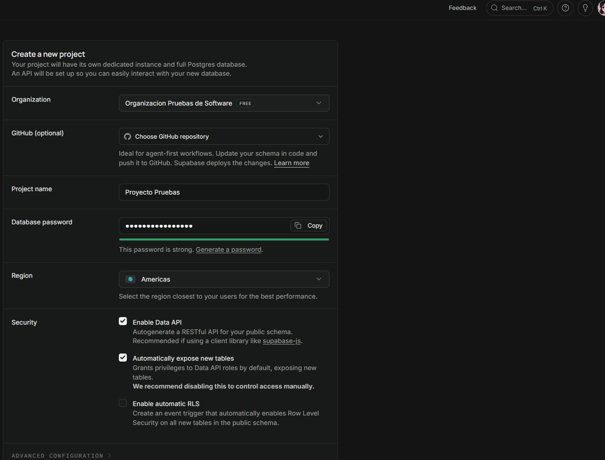
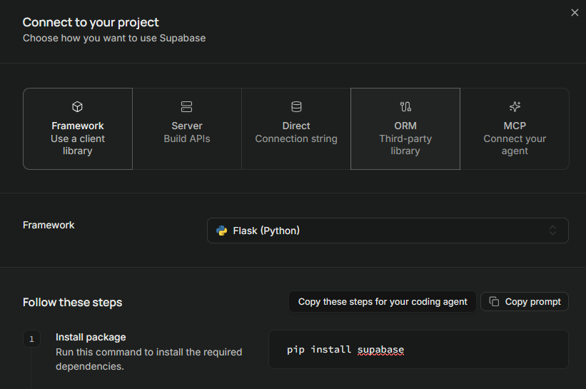
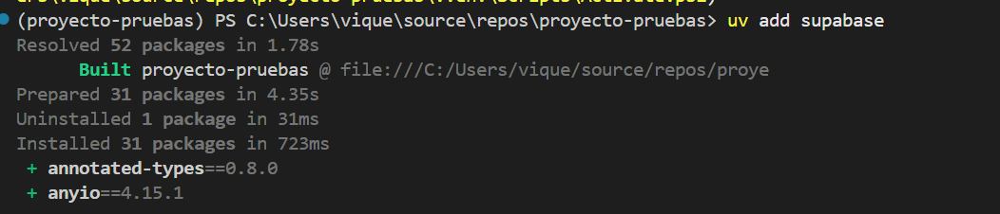
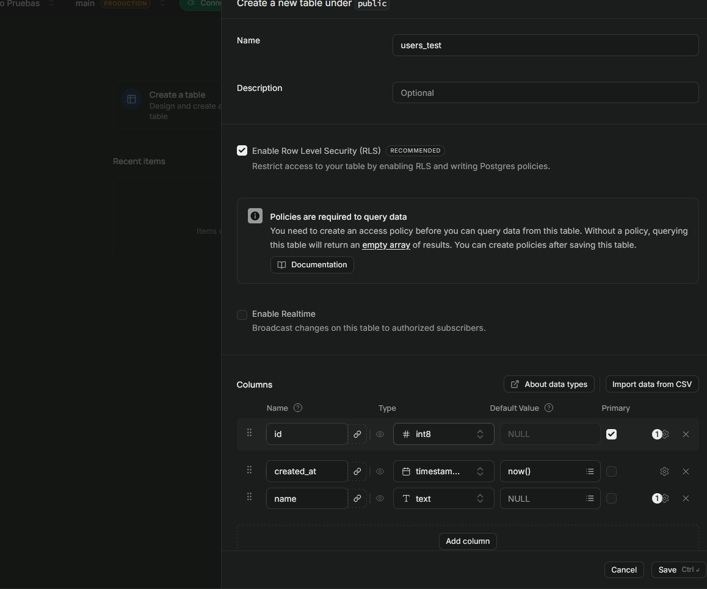
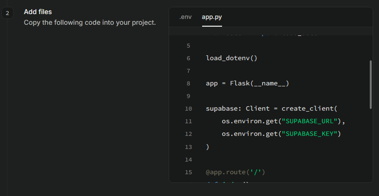
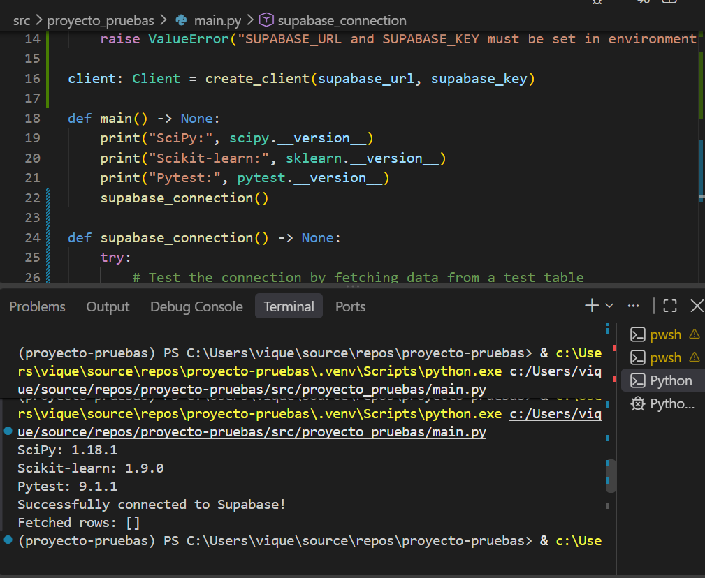
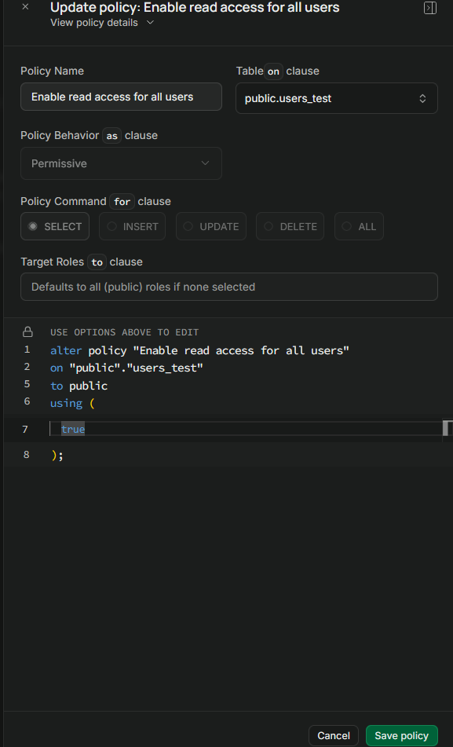
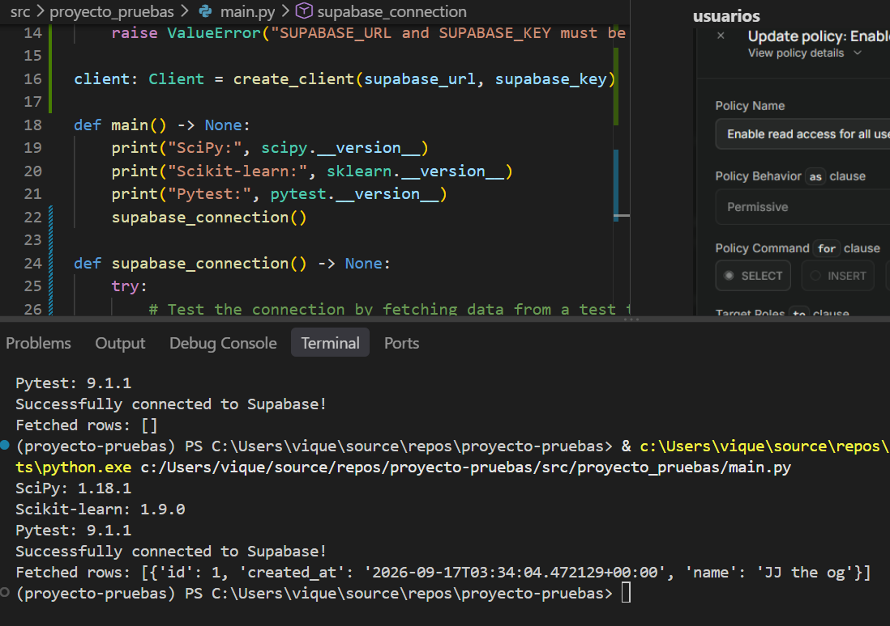
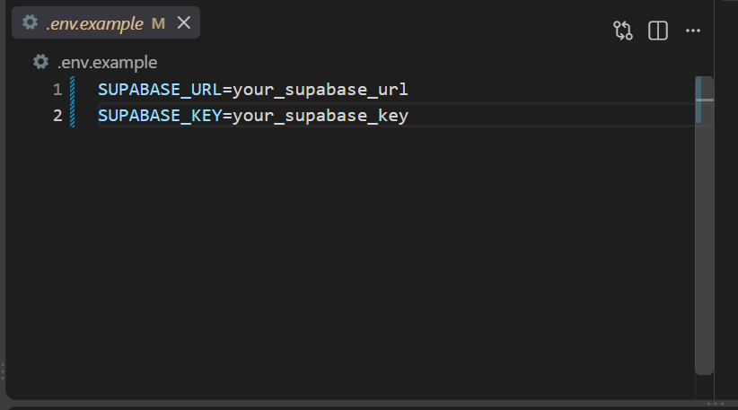

## Evidencias de configuracion supabase

### Configuración del Supabase

Se accede al pagina oficial de Supabase y se crea un proyecto, se selecciona la región america y se le asigna un nombre al proyecto.

Pagina oficial: [https://supabase.com/](https://supabase.com/)

Captura:

**Explicación**: Se crea el proyecto en Supabase Proyecto Pruebas dentro de la Organizacion Pruebas de Software. 

### Instalación/configuración del cliente de Supabase

Captura:

**Doc oficial supabase**

**Ejecucion de terminal con uv**

**Se crea tabla de prueba en supabase**

**Se toma codigo de ejemplo y se adapta para prueba de conexión**

**Se realiza primera prueba, falla por no tener permisos**

**Se configura la tabla para permitir lectura a todos los usuarios**

**Operacion de select exitosa**

### Configuración de las variables de entorno

Captura:

Explicación:
Se configuran las variables de entorno en el archivo .env, se agregan las variables SUPABASE_URL y SUPABASE_KEY con los valores obtenidos del proyecto en supabase, tambien se podrian definir como variables de entorno del sistema operativo, pero se opta por definirlas en el archivo .env para que sean cargadas automaticamente al ejecutar el proyecto.