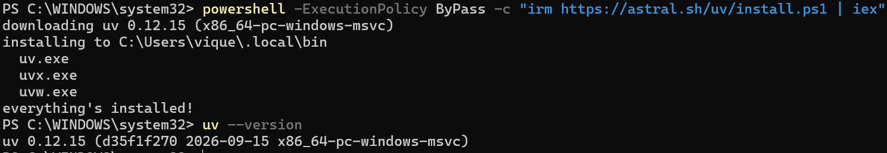

### Instalación de Python

**Captura:**
 

**Explicación**:
 
No se instala python directamente, sino que se instala uv, el mismo se encarga de instalar la versión de python que se necesita para el proyecto y las dependencias necesarias para el proyecto.

### Creación del proyecto en UV (Creación del entorno virtual, instalación de dependencias y archivo de requirements.txt)

**Captura:**
 

**Explicación:**
 
Se hace la syncronización del proyecto con uv, el mismo se encarga de crear el entorno virtual y se instalan las dependencias necesarias para el proyecto.